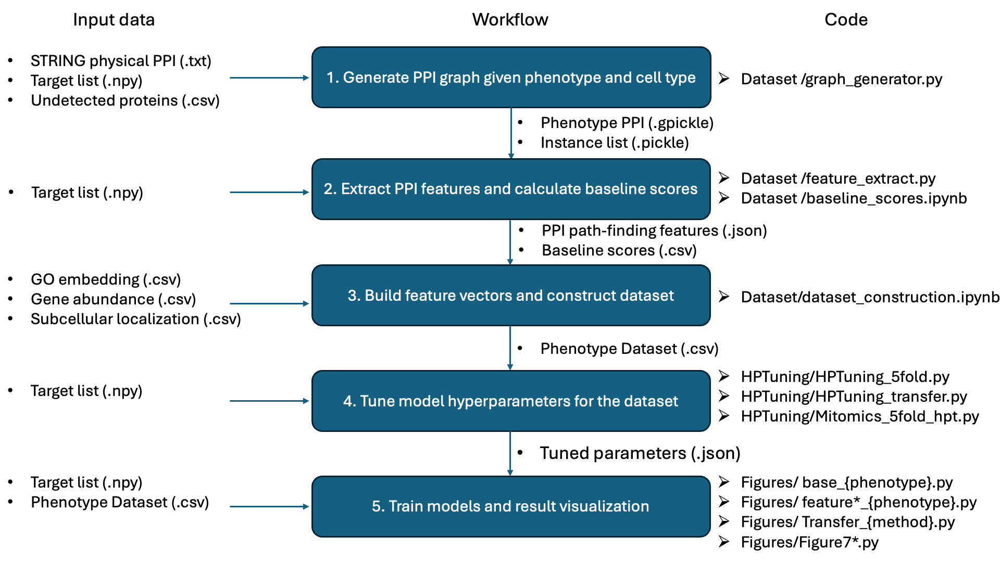

# graph-molecular-phenotype-prediction
Code accompanying the paper "A graph-based learning approach to predict the effects of gene perturbations on molecular phenotypes" by Jin et al.

---

## 📁 Folder Structure
 ```.
Legend: `/` = directory, no suffix = file
├──Datasets/
    ├──Influenza/
        ├──split_feature_group/
        ├──split_subgraph/
        ├──other data files
    ├──SREBP2/
        ├──split_feature_group/
        ├──split_subgraph/
        ├──other data files
    ├──LDLR/
        ├──split_feature_group/
        ├──split_subgraph/
        ├──other data files
    ├──Mitomics/
        ├──split_feature_group/
        ├──split_subgraph/
        ├──other data files
    ├──targets/ (target list for each phenotype)
    ├──Raw/
        ├──cellular-localization/ (celltype-specific protein abundance)
        ├──{phenotype}/ (instance list for each phenotype)
        ├──go_embedding_64.csv
        ├──subcellular-localization.csv 
        ├──uniprot_reactome_hpa_merged_stringid.csv (raw file for subcellular localization)
    ├──config/ (tuned hyperparameters for each model for each phenotype for each fold for each subset)
├──Code/
├──Plot/
    ├──{phenotype}/ (Files necessary for feature importance and transfer learning replication)
```

## 🚀 Getting Started


### Prerequisites
- necessary packages are listed in file [environment.yml](environment.yml)

### Instructions
- Here is the workflow of our proposed method 
- In this paper we collect four phenotypes as well as four machine learning methods, each phenotype and method has its own abbreviation in the script name.  
Cholesterol homeostasis ── SREBP2  
Cholesterol uptake ── LDLR  
Influenza A virus replication ── Influenza  
Mitochondrial protein abundance ── Mitomics  
Logistic Regression ── LR  
Random Forest ── RF  
XGBoost ── XGB  
Neural Network ── NN  

- To replicate Figure 2 and 3 for a phenotype, run base_{phenotype}. e.g. For phenotype cholesterol uptake, run [base_LDLR.py](./Code/base_LDLR.py)    
- To replicate Figure 4, first run feature_subgraph_{phenotype}.py for each phenotype, then run [Feature_importance.ipynb](./Code/Feature_importance.ipynb).  
- To replicate Figure 5, first run feature_feature_group_{phenotype}.py for each phenotype, then run [Feature_importance.ipynb](./Code/Feature_importance.ipynb).  
- For phenotype Mitochondrial protein abundance, [feature_Mitomics.py](./Code/feature_Mitomics.py) would generate files for both Figure 4 and 5.  
- To replicate Figure 6, first run Transfer_{ML-method}.py, then run [Transfer_learning.ipynb](./Code/Transfer_learning.ipynb).


